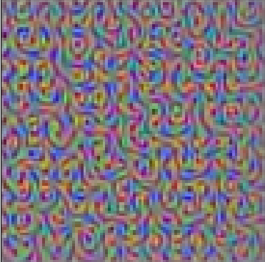

# CNN Filter Visualization 🔎

This project visualizes the filters of a **Convolutional Neural Network (CNN)** using the pretrained **VGG16** model in TensorFlow.

## 📌 Overview
- Loads **VGG16** pretrained on ImageNet  
- Extracts convolutional layers  
- Uses **gradient ascent** to maximize filter activations  
- Visualizes what each filter has learned  

## 🚀 Setup & Usage

### 1. Install dependencies
```bash
pip install tensorflow matplotlib
````

### 2. Available Conv Layers

```
['block1_conv1', 'block1_conv2',
 'block2_conv1', 'block2_conv2',
 'block3_conv1', 'block3_conv2', 'block3_conv3',
 'block4_conv1', 'block4_conv2', 'block4_conv3',
 'block5_conv1', 'block5_conv2', 'block5_conv3']
```

## 🖼 Example Output



## ✅ Requirements

* Python 3.x
* TensorFlow 2.18+
* Matplotlib

## 📖 Explanation

The script starts from a random noise image and iteratively updates it using **gradients** to maximize the activation of a filter.
This produces patterns that reveal **what features (edges, textures, shapes)** each CNN filter responds to.

🔗 Inspired by deep learning visualization techniques.

## 📚 Further Reading

* [Feature Visualization – Distill](https://distill.pub/2017/feature-visualization/)
* [Coursera: Visualizing Filters in CNNs (TensorFlow)](https://www.coursera.org/learn/visualizing-filters-cnn-tensorflow)

